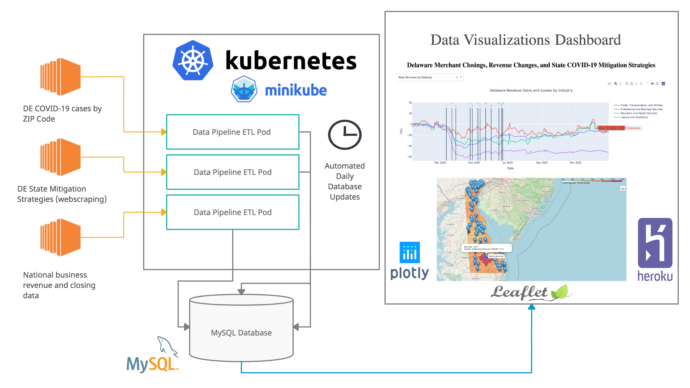
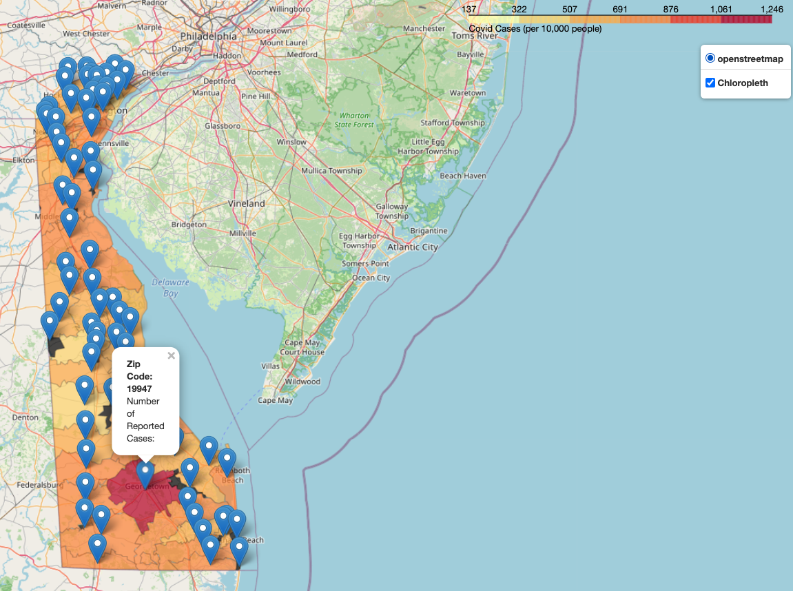

# DE_COVID_small_business_project

## About
This project is to explore the correlations between Delaware State COVID restrictions and small business closures and loss in revenue. In addition, this project illustrates Delaware COVID case counts by ZIP code.

## How it works:

### Three data pipelines clean and store data in a MYSQL database:
* Covid cases by ZIP code 
* Delaware Mitigation Strategies
* Business closures and revenue
### Pipelines deployed in Kubernetes
### Data retrieved from MYSQL to create visualizations with Folium and matplotlib

## Technologies Used:
* Python
* AWS Lightsail MySQL database
* Pandas
* Kubernetes (minikube) 
* Folium
* Jupyter Notebook
### Data from:
#### Covid Case Data
https://myhealthycommunity.dhss.delaware.gov/locations/state
#### Business Data
The Economic Tracker at  https://tracktherecovery.org and accompanying paper https://opportunityinsights.org/wp-content/uploads/2020/05/tracker_paper.pdf.
#### Mitigation Strategies
https://myhealthycommunity.dhss.delaware.gov/locations/state/coronavirus-mitigation#contact-tracing-timeline

