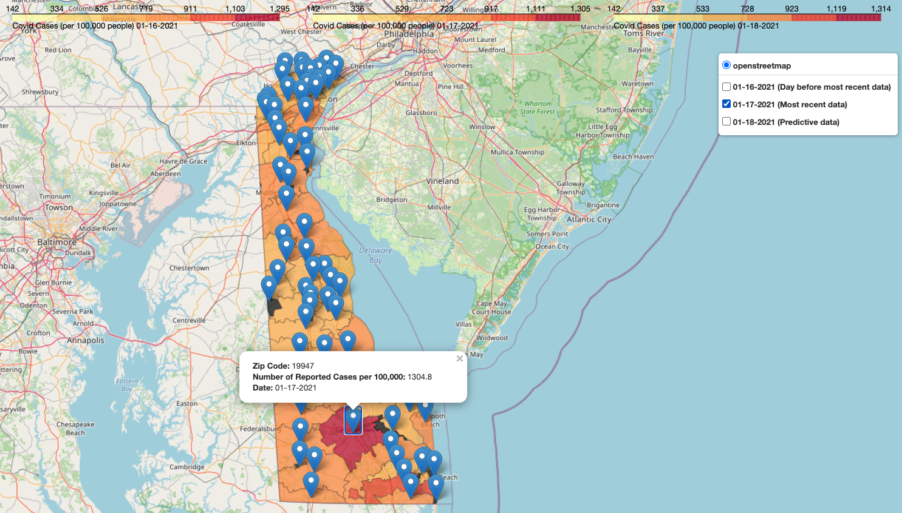
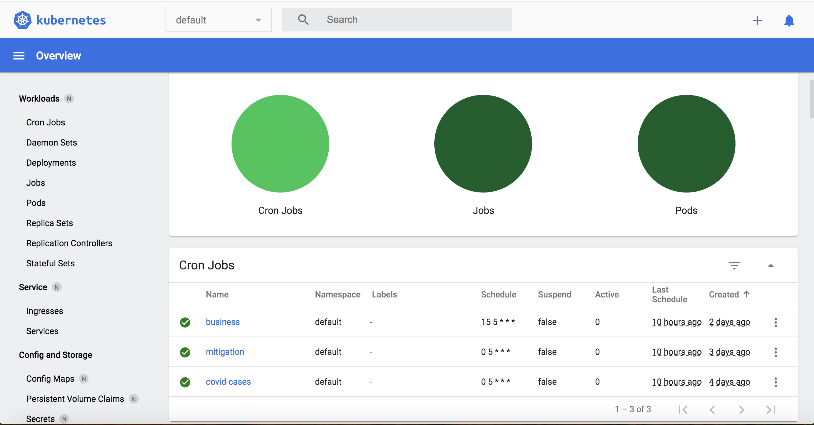

# DE_COVID_small_business_project

## About
This project was designed to explore the correlations between Delaware State COVID restrictions and small business closures and loss in revenue. In addition, this project illustrates Delaware COVID case counts by ZIP code as well as predict tomorrow's COVID case counts. [View our dashboard.](https://de-covid-project.herokuapp.com/)

## How it works:

### Three data pipelines clean and store data in a MYSQL database:
* Covid cases by ZIP code 
* Delaware Mitigation Strategies
* Business closures and revenue

### Data retrieved from MYSQL to create visualizations with Folium and Plotly

## Technologies Used:
* Python
* AWS Lightsail MySQL database
* Pandas
* Kubernetes (minikube)
* Docker 
* Folium
* Plotly
* Dash
* Jupyter Notebook

## Deploying Pipelines on Kubernetes:

For this project, we decided to utilize Kubernetes to automate our data updates. Since we have three separate data pipelines that retrieve, clean, and store data from three separate sources,deploying our pipelines as pods in Minikube has a variety of benefits:
* Easy to Edit and Scale:
    * For each pipeline, we created a Docker image that has all the instructions to create a container with the right environment for our pipeline to run and the command to run it.
    Edits to our pipelines themselves are as simple as removing a Docker image, editing the Python file, 
    and building the Docker image again. Adding new pipelines are as easy as creating and building a Docker image and writing a Kubernetes yaml file. 
* Pod Deployment as Tasks:
    * Because Kubernetes pods are designed to be easily created and destroyed, the deployment of our pods themselves run our pipelines. 
    Once our pods have been deployed, they have fulfilled their duty and the database has been updated.  
* Easily Orchestrated and Automated:
    * Our system is automated through Kubernetes Cron Jobs. The deployment of our pods are written as Cron Job yaml files which have a schedule for deployment. 
    Every day, a job for each pipeline is created which, in turn, deploys a new pod and destroys yesterday’s pod.
### Data from:
#### Covid Case Data
https://myhealthycommunity.dhss.delaware.gov/locations/state
#### Business Data
The Economic Tracker at  https://tracktherecovery.org and accompanying paper https://opportunityinsights.org/wp-content/uploads/2020/05/tracker_paper.pdf.
#### Mitigation Strategies
https://myhealthycommunity.dhss.delaware.gov/locations/state/coronavirus-mitigation#contact-tracing-timeline

